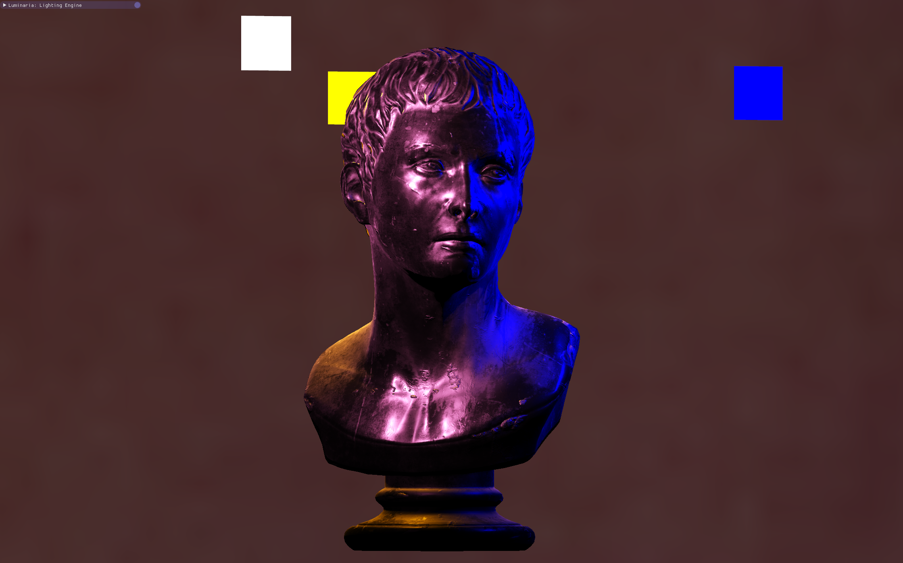

<!-- PROJECT LOGO -->
<br />
<div align="center">
  <a href="github link here">
    
  </a>

  <h3 align="center">Luminaria: Physically Based Lighting Engine</h3>

  <p align="center">
    This repo serves to host a real-time demo of my lighting engine, Luminaria, running on OpenGL. It is capable of PBR and IBL, achieving high-quality and realistic 3D graphics.
    <br />

<br>


<!-- ABOUT THE PROJECT -->
## About The Project

![Luminaria Video][product-screenshot]

Having used game engines in the past extensively, I always wondered how they worked under the hood.

As a student looking to get into the world of graphics programming, I wanted to create this engine to find the answer to this question, test myself, and see if I could achieve high-fidelity graphics. As of writing this, I am about to begin my master's degree in Electrical and Electronics Engineering at Imperial College London, and this project serves as a precursor to some of the research I may want to pursue at university.

Thus, this project serves a threefold purpose:
* Displaying my ability in programming in C++ and OpenGL.
* Giving me a better understanding of graphics rendering at the lowest level.
* Creating pretty 3D scenes for future projects of mine.

<p align="right">(<a href="#readme-top">back to top</a>)</p>


### Built On:

* [![C++][Cpp]][Cpp-url]
* [![OpenGL][OpenGL]][OpenGL-url]


<!-- GETTING STARTED -->
## Build Instructions

This project was developed in Visual Studio, and has been packaged with CMake as to be built anywhere.

To build the project using CMake via CLI, follow these steps on any UNIX-based OS:

### Generating Visual Studio Project

```sh
cd path/to/LuminariaCMake
mkdir build
cd build
cmake ..
cmake --build .
cmake --install .
```


<!-- USAGE EXAMPLES -->
## Screenshots





<!-- LICENSE -->
## License

Distributed under the MIT License. See `LICENSE` for more information.


<!-- CONTACT -->
## Contact

Anurag Thakur - anurag.rajeev.thakur@gmail.com  |  at3424@ic.ac.uk

Project Link: [https://github.com/your_username/repo_name](https://github.com/your_username/repo_name)


<!-- ACKNOWLEDGMENTS -->
## Acknowledgments

* [EECS-2020-29 Berkeley Tech Report](https://www2.eecs.berkeley.edu/Pubs/TechRpts/2020/EECS-2020-29.pdf)
* [Disney BRDF Notes](https://media.disneyanimation.com/uploads/production/publication_asset/48/asset/s2012_pbs_disney_brdf_notes_v3.pdf)
* [Learn OpenGL](https://learnopengl.com/)
* [The Cherno YouTube Channel](https://www.youtube.com/@TheCherno)


<!-- MARKDOWN LINKS & IMAGES -->
<!-- https://www.markdownguide.org/basic-syntax/#reference-style-links -->
[contributors-shield]: https://img.shields.io/github/contributors/othneildrew/Best-README-Template.svg?style=for-the-badge
[contributors-url]: https://github.com/othneildrew/Best-README-Template/graphs/contributors
[forks-shield]: https://img.shields.io/github/forks/othneildrew/Best-README-Template.svg?style=for-the-badge
[forks-url]: https://github.com/othneildrew/Best-README-Template/network/members
[stars-shield]: https://img.shields.io/github/stars/othneildrew/Best-README-Template.svg?style=for-the-badge
[stars-url]: https://github.com/othneildrew/Best-README-Template/stargazers
[issues-shield]: https://img.shields.io/github/issues/othneildrew/Best-README-Template.svg?style=for-the-badge
[issues-url]: https://github.com/othneildrew/Best-README-Template/issues
[license-shield]: https://img.shields.io/github/license/othneildrew/Best-README-Template.svg?style=for-the-badge
[license-url]: https://github.com/othneildrew/Best-README-Template/blob/master/LICENSE.txt
[linkedin-shield]: https://img.shields.io/badge/-LinkedIn-black.svg?style=for-the-badge&logo=linkedin&colorB=555
[linkedin-url]: https://linkedin.com/in/othneildrew
[product-screenshot]: images/Luminaria_video.mp4
[GLFW]: https://img.shields.io/badge/GLFW-3A6E8F?style=for-the-badge&logo=glfw
[GLFW-url]: https://www.glfw.org/

[GLAD]: https://img.shields.io/badge/GLAD-FCC624?style=for-the-badge&logo=opengl
[GLAD-url]: https://glad.dav1d.de/

[GLM]: https://img.shields.io/badge/GLM-76B900?style=for-the-badge&logo=glm
[GLM-url]: https://github.com/g-truc/glm

[stb]: https://img.shields.io/badge/stb-333333?style=for-the-badge&logo=stb
[stb-url]: https://github.com/nothings/stb

[Assimp]: https://img.shields.io/badge/Assimp-23587D?style=for-the-badge&logo=assimp
[Assimp-url]: http://assimp.org/

[Cpp]: https://img.shields.io/badge/C++-00599C?style=for-the-badge&logo=c%2B%2B&logoColor=white
[Cpp-url]: https://cplusplus.com/

[OpenGL]: https://img.shields.io/badge/OpenGL-FFFFFF?style=for-the-badge&logo=opengl
[OpenGL-url]: https://www.opengl.org/


